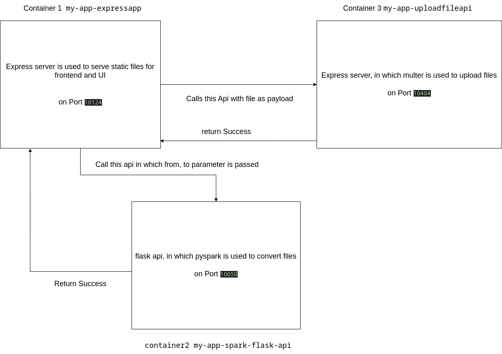

## DATATRANSFORMER
To convert any file within csv, json, and parquet jsut within few few clicks

#### Prerequisites
* Docker and Docker-Compose

#### Description
File conversion in any format csv, Json, parquet

* Csv to Parquet
* Csv to Json
* Json to Parquet
* Json to Csv
* Parquet to Csv
* Parquet to Json

#### How to use it 

```bash
    git clone https://github.com/ujjawal-mandhani/DataFormatTransformer.git
    cd DataFormatTransformer/my-app/
    docker-compose up
```

open http://0.0.0.0:10124/ in any browser


#### What's Next?
Excel and avro files conversion will be supported soon

* Excel 
* Avro

#### Tools used

* Node, NPM, NPM, nodemon, express, multer
* Docker, docker-compose
* python, flask, flask-cors, pyspark
* HTML, CSS, JavaScript

#### Architectural diagram



#### Special thanks

* ChatGPT